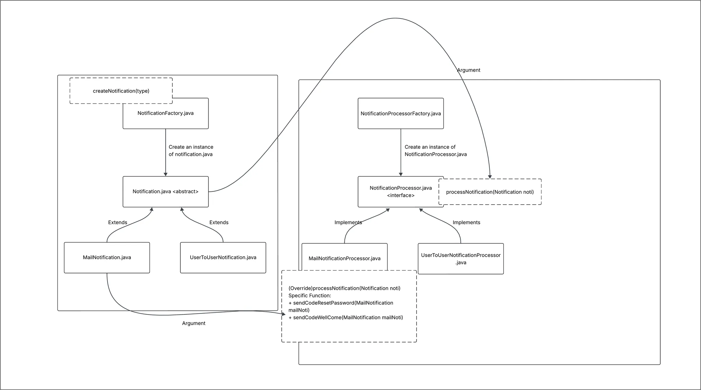

# word-wise

## API Documents - Version 1.0

## Account Management
**1. Sign Up**
```
curl --location 'localhost:8080/user/register' \
--header 'Content-Type: application/json' \
--data-raw '{
    "email": "tandungnguyen123@gmail.com",
    "password": "12345"
}'
```

**2. Login**
```
curl --location 'localhost:8080/user/login' \
--header 'Content-Type: application/json' \
--data-raw '{
    "email": "tandungnguyen123@gmail.com",
    "password": "12345"
}'
```

**3. Reset Password**
```
curl --location 'localhost:8080/user/reset-password' \
--header 'Content-Type: application/json' \
--data-raw '{
    "email": "tandungnguyen918@gmail.com",
    "password": "1234567",
    "code": "156569"
}'
```

## Word Management
**1. Insert Word**
```
curl --location 'http://localhost:8080/word/insertWord' \
--header 'Content-Type: application/json' \
--data '{
    "context": "example context", // context sentence
    "englishWord": "hello",
    "vietnameseWord": "xin chào", // translate from frontend
    "isExtension": false, // true: insert from the extension
    "note": "sample note", // user can note something on this word
    "userId": "123"
  }'
```

**2. Edit Word**
```
curl --location 'http://localhost:8080/word/editWord' \
--header 'Content-Type: application/json' \
--data '{
    "wordId": "77cb390b-8b2b-4154-8134-a524b1641bc8",
    "context": "example context1234",
    "englishWord": "hello1234",
    "vietnameseWord": "xin chào1234",
    "isExtension": true,
    "note": "sample note 1234"
}'
```

**3. Get words within pagination**
```
curl --location 'http://localhost:8080/word/words?page=0&size=3' \
--header 'Content-Type: application/json' \
--header 'Authorization: Bearer token' \
--data ''
```
## System Organization
### 1. Notification

**How to use**
*1. Inject notificationFactory and notificationProcessorFactory*
```
@Autowired 
NotificationFactory notificationFactory;

@Autowired 
NotificationProcessorFactory notificationProcessorFactory;
```
*2. Call function to handle logic*
```
- Notification notification = this.notificationFactory.createNotification(NotificationEnum.Mail);
- NotificationProcessor notificationProcessor = this.notificationProcessorFactory.createProcessor(NotificationEnum.Mail);
notificationProcessor.process(notification);
```