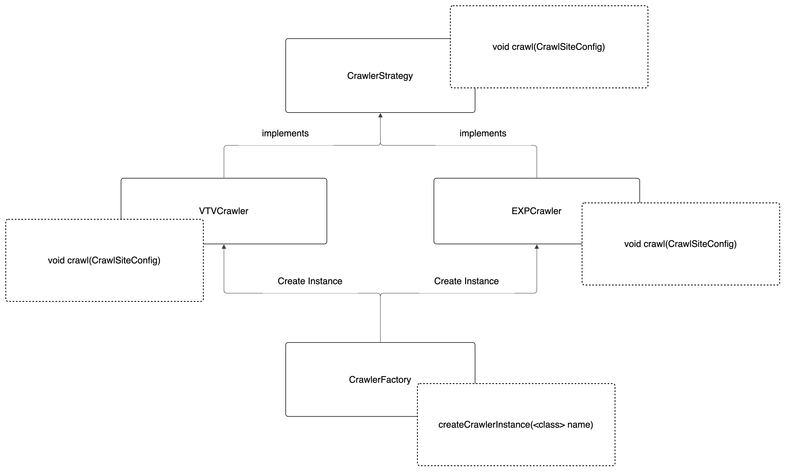

# word-wise

## API Documents - Version 1.0

## Account Management
**1. Sign Up**
```
curl --location 'localhost:8080/user/register' \
--header 'Content-Type: application/json' \
--data-raw '{
    "email": "tandungnguyen123@gmail.com",
    "password": "12345"
}'
```

**2. Login**
```
curl --location 'localhost:8080/user/login' \
--header 'Content-Type: application/json' \
--data-raw '{
    "email": "tandungnguyen123@gmail.com",
    "password": "12345"
}'
```

**3. Reset Password**
```
curl --location 'localhost:8080/user/reset-password' \
--header 'Content-Type: application/json' \
--data-raw '{
    "email": "tandungnguyen918@gmail.com",
    "password": "1234567",
    "code": "156569"
}'
```

## Word Management
**1. Insert Word**
```
curl --location 'http://localhost:8080/word/insertWord' \
--header 'Content-Type: application/json' \
--data '{
    "context": "example context", // context sentence
    "englishWord": "hello",
    "vietnameseWord": "xin chào", // translate from frontend
    "isExtension": false, // true: insert from the extension
    "note": "sample note", // user can note something on this word
    "userId": "123"
  }'
```

**2. Edit Word**
```
curl --location 'http://localhost:8080/word/editWord' \
--header 'Content-Type: application/json' \
--data '{
    "wordId": "77cb390b-8b2b-4154-8134-a524b1641bc8",
    "context": "example context1234",
    "englishWord": "hello1234",
    "vietnameseWord": "xin chào1234",
    "isExtension": true,
    "note": "sample note 1234"
}'
```

**3. Get words within pagination**
```
curl --location 'http://localhost:8080/word/words?page=0&size=3' \
--header 'Content-Type: application/json' \
--header 'Authorization: Bearer token' \
--data ''
```

## New Feed Management
**1. Get New Feed**
```
curl --location 'http://localhost:8080/new-feed' \
--header 'Content-Type: application/json' \
--data ''
```

## Extension Management 
**1. Get extension review**
```
curl --location 'localhost:8080/review-extension' \
--header 'Authorization: Bearer ...'
```

**2. Submit answer**
```
curl --location 'localhost:8080/review-extension' \
--header 'Content-Type: application/json' \
--header 'Authorization: Bearer ...' \
--data '{
    "reviewId": "880d408b-1e0b-4d11-b2b9-92eb52ed0dc6",
    "isTrue": true
}'
```

## System Organization
### 1. Notification


**How to use**

*1. Inject notificationFactory and notificationProcessorFactory*
```
@Autowired 
NotificationFactory notificationFactory;

@Autowired 
NotificationProcessorFactory notificationProcessorFactory;
```
*2. Call function to handle logic*
```
- Notification notification = this.notificationFactory.createNotification(NotificationEnum.Mail);
- NotificationProcessor notificationProcessor = this.notificationProcessorFactory.createProcessor(NotificationEnum.Mail);
notificationProcessor.process(notification);
```

### 2. Web Crawler

**1. Data Structure**
- CrawlComponent.java 
- CrawSiteConfig.java
- JsonConfig.json 
```
[
  {
    "site": "VTV",
    "url": "https://vtv.vn/vtv24.html",
    "component": {
      "query": ".box-category-item",
      "elementType": "div",
      "childComponents": [
        {
          "query": ".box-category-link-title",
          "elementType": "a",
          "attributes": [
            "href"
          ]
        },
        {
          "query": ".box-category-avatar",
          "elementType": "img",
          "attributes": [
            "src"
          ]
        },
        {
          "query": ".box-category-sapo",
          "elementType": "div",
          "isGetText": true // we need to get data of the elements's attributes or text
        }
      ]
    }
  }
]
```


## Problems and Solutions 
### 1. SpringBoot auto inject with addFilterBefore() function  
**Problem**
- Step1: We create JWTAuthenticatorFilter class with annotation @Component
- Step2: We inject JWTAuthenticatorFilter into SecurityConfig class with annotation @Autowired

*Problem*: Spring boot will throw exception because JWTAuthentication Bean was registered.

*Why*: 
- First Register: @Autowired
- Second Register: addFilterBefore() this function will automatically find and register a bean in the Spring Boot container.

*Solution*:
- Configure for Spring Boot to not register JWTAuthenticationFilter automatically when function .addFilterBefore() is triggered
```
@Bean
public FilterRegistrationBean<JWTAuthenticationFilter> disableAutoRegistration(JWTAuthenticationFilter filter) {
    FilterRegistrationBean<JWTAuthenticationFilter> registration = new FilterRegistrationBean<>(filter);
    registration.setEnabled(false); // Ngăn Tomcat tự init filter
    return registration;
}
```